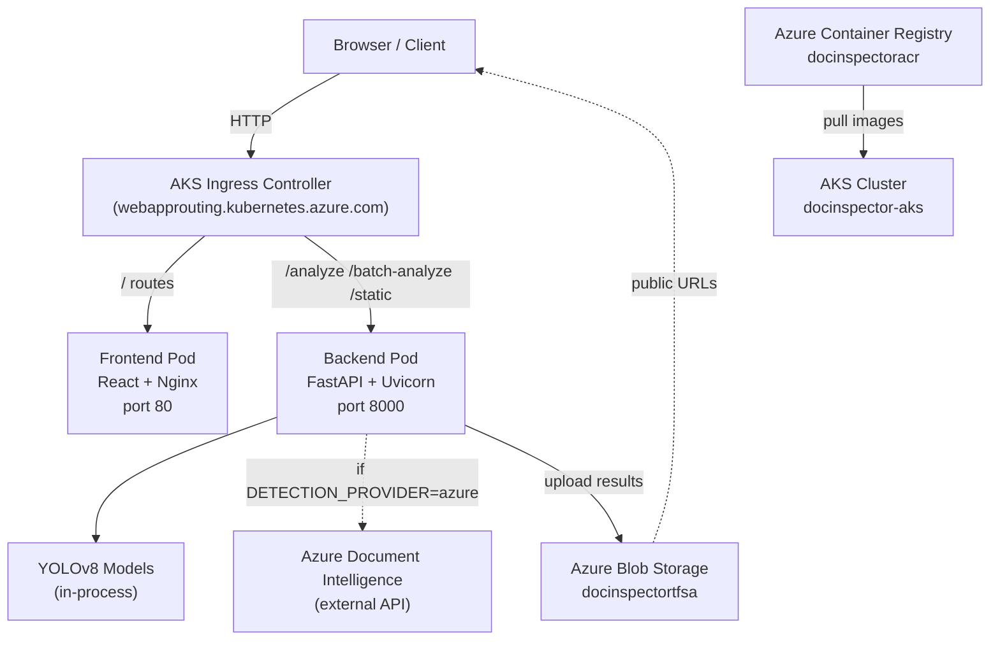
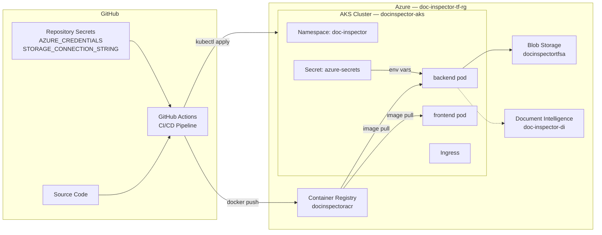
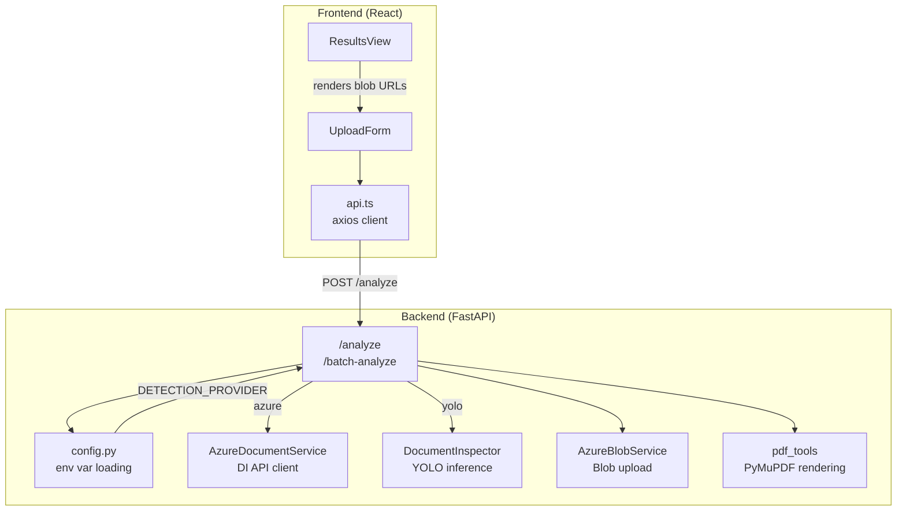
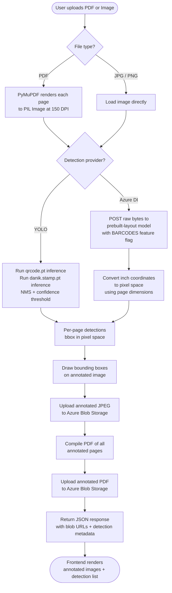
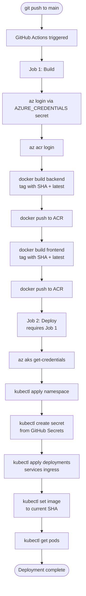

# Digital Document Inspector — Architecture & Implementation

---

## 6. Methodology / System Development

### Development Process

The system was designed around a single core problem: automating the detection of QR codes and signatures in scanned document PDFs — a task that existing general-purpose AI services handle poorly because they were not purpose-built for it.

Development followed this sequence:
1. Dataset construction and model training
2. Local API and frontend development
3. Containerization
4. Cloud infrastructure provisioning (IaC)
5. Kubernetes deployment
6. CI/CD automation

### Technologies & Tools

| Category | Technology | Purpose |
|---|---|---|
| CV Model | YOLOv8 (Ultralytics) | QR code and signature detection |
| Labeling | Roboflow | Ground-truth annotation |
| Backend | FastAPI (Python 3.10) | REST API, file processing |
| Frontend | React + Vite | Upload UI, result rendering |
| PDF rendering | PyMuPDF | PDF → image conversion per page |
| Containerization | Docker | Reproducible runtime packaging |
| Orchestration | Kubernetes (AKS) | Scalable cloud deployment |
| IaC | Terraform | Declarative Azure resource provisioning |
| CI/CD | GitHub Actions | Automated build and deploy pipeline |
| Registry | Azure Container Registry | Private Docker image storage |
| Storage | Azure Blob Storage | Annotated result persistence |
| Cloud AI | Azure Document Intelligence | Comparative cloud-native detection |

### AI Model

The primary detection engine is **YOLOv8**, trained on a custom dataset of scanned documents. Because no labeled dataset existed for this specific domain, the data pipeline was built from scratch:

- Raw document scans were collected and manually annotated via **Roboflow** to establish ground truth bounding boxes for QR codes and signatures
- The dataset was synthetically extended to **~20,000 images** through augmentation: Gaussian noise, brightness/contrast shifts, blur filters, rotation, and cropping — to improve generalization across real-world scan conditions
- Two separate models were trained: `qrcode.pt` and `danik.stamp.pt` (signature/stamp detector)

**Azure Document Intelligence** (prebuilt-layout model with BARCODES add-on) was also integrated as an alternative provider. It detects QR codes at high confidence but underperforms on signatures — expected, since it is a general document understanding model not trained on this distribution.

### Containerization

Each service is packaged as a Docker image:
- **Backend**: `python:3.10-slim` base, YOLO models baked in at build time, dependencies installed without cache to minimize layer size
- **Frontend**: Multi-stage Vite build, served via Nginx

Images are tagged with both `latest` and the Git commit SHA for traceability.

### Cloud Platform

All infrastructure runs on **Microsoft Azure**, provisioned via Terraform:
- **AKS** (Azure Kubernetes Service) for container orchestration
- **ACR** (Azure Container Registry) for private image hosting
- **Azure Blob Storage** for result persistence with public blob read access

---

## 7. System Architecture

### High-Level Architecture



### Deployment Diagram



### Module Diagram



---

## 8. Flowchart / Working Pipeline

### Document Analysis Flow



### CI/CD Pipeline Flow



---

## 9. Implementation Details

### Frontend

React SPA built with Vite. The API base URL is resolved at runtime via `VITE_API_BASE` environment variable — if empty (production), requests use relative paths (`/analyze`) which the ingress routes to the backend. If set to `http://localhost:8000` (local dev via `.env.local`), requests go directly to the local server.

File upload is multipart/form-data via Axios. Results render per-page with annotated image URLs (served from Blob Storage) alongside structured detection JSON.

### Backend

FastAPI application with two routes:
- `POST /analyze` — single file (PDF, JPG, PNG)
- `POST /batch-analyze` — ZIP of PDFs

Detection provider is selected at startup based on `DETECTION_PROVIDER` env var:
```
"yolo"  → DocumentInspector (YOLOv8 inference, both models run per page)
"azure" → AzureDocumentService (Document Intelligence API)
"auto"  → Azure if credentials present, YOLO otherwise
```

PDF pages are rendered at 150 DPI via PyMuPDF before passing to either provider. Azure DI receives raw PDF bytes directly (no rendering needed) and returns polygon coordinates in inches, which are converted to pixel space using the rendered page dimensions.

### YOLOv8 Integration

Two model weights are loaded at startup into `DocumentInspector`. Each page image is run through both models independently; detections are merged and returned as `[x1, y1, x2, y2, confidence, class]`. Confidence thresholds: `0.65` for QR codes, `0.25` for signatures/stamps (lower threshold because stamp appearance varies significantly across documents).

### Azure Document Intelligence Integration

The BARCODES feature must be explicitly requested — it is an add-on, not enabled by default:
```python
poller = client.begin_analyze_document(
    "prebuilt-layout",
    body=pdf_bytes,
    content_type="application/pdf",
    features=[DocumentAnalysisFeature.BARCODES],
)
```
Without this flag, QR code detections return zero results regardless of document content.

### Azure Blob Storage

Results are stored under `{filename}_{timestamp}/` prefixes within the `documents` container. The container has public blob access enabled — annotated images and PDFs are returned as direct public URLs with no SAS token overhead, appropriate for a demo context.

### Terraform (IaC)

All Azure infrastructure is declared in `terraform/main.tf` with `azurerm ~4.0`. Resources:
- `azurerm_resource_group` — scopes all resources
- `azurerm_container_registry` — Basic SKU, admin enabled for local `docker push`
- `azurerm_kubernetes_cluster` — SystemAssigned identity, Free tier, 1 node
- `azurerm_role_assignment` — grants AKS kubelet identity AcrPull on ACR, eliminating the need for imagePullSecrets
- `azurerm_storage_account` + `azurerm_storage_container` — public blob access

Document Intelligence is excluded from Terraform — Azure restricts F0 tier to one instance per subscription, so the existing resource is referenced directly via `.env`.

### Kubernetes

Path-based ingress routes traffic to the correct service. Backend and frontend run as separate Deployments with ClusterIP Services (not exposed externally). The ingress controller (Azure App Routing addon) holds the single public IP.

Credentials are never stored in the image or repository — the `azure-secrets` Kubernetes Secret is generated at deploy time by the CI/CD pipeline from GitHub repository secrets using `kubectl create secret --dry-run=client -o yaml | kubectl apply -f -`, which is idempotent (creates or updates).

### Storage Result Structure

```
documents/
└── invoice_scan_20260421_154532/
    ├── page_1.jpg        ← annotated page image
    ├── page_2.jpg
    └── annotated.pdf     ← full annotated document
```
